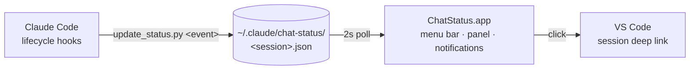

<div align="center">

# ChatStatus

**Every Claude Code chat, live in your menu bar.**

One glance for what's working, what's blocked, what finished — one click to jump back into the exact conversation in VS Code.

&nbsp;&nbsp;&nbsp;


</div>

The menu bar shows a count per status; the panel shows one card per chat — name (AI-summarized), repo · branch, what it's blocked on, and a live turn clock.

| | Status | Meaning |
|:-:|---|---|
| ✳ | **working** | animated Claude spark + `2m 52s` turn clock (true time since your prompt) |
| ● | **needs you** | orange, with the exact blocker — `Bash: git push origin main`, or the question asked |
| ● | **errored** | red, with the cause (rate limit, auth, overload…) — a dead turn never plays busy |
| ✓ | **finished** | green, with Claude's closing message so you can triage without opening the chat |
| ✳ | **idle** | dim — session open, nothing running |

## Install

```bash
./install.sh              # build, register hooks, launch
./install.sh --login      # also auto-start at login
./install.sh --uninstall  # remove hooks + login item
```

Idempotent, clone-anywhere. Requires macOS and [`jq`](https://jqlang.github.io/jq/); conversation deep-links need VS Code with the Claude Code extension (CLI chats in a terminal are tracked too, and clicks focus that terminal instead).

## Using it

- **Click a card** (or its notification) → jumps to where the chat lives. VS Code chats focus that repo's window and deep-link the exact conversation via `vscode://anthropic.claude-code/open`; CLI chats focus their terminal app (marked on the card — app-level, no tab focus, and tmux-server sessions can't be focused).
- **Notifications** fire on *needs you* / *errored* / *finished* — one live banner per chat, withdrawn automatically once you've answered or the state moves on. Left waiting 5 minutes, you get one follow-up ping.
- **Hover a card** to rename (✎ — your label replaces repo · branch everywhere, including notifications) or remove (✕).
- **A finish with background tasks still running isn't "finished"** — the card shows *background* and completes for real when the work stops.
- **⌃⌥C** toggles the panel from anywhere · **Esc** closes it · **right-click** the menu bar item for a quick menu. Rebind the hotkey: `defaults write com.measure.chatstatus hotkeyKeyCode -int <code>` (+ `hotkeyModifiers`).
- Chats whose Claude process died without a clean exit are reaped in seconds (PID + start-time check); anything silent for 24h is pruned.

> [!NOTE]
> **AI summaries** (macOS 26+ with Apple Intelligence): card names become ~6-word on-device summaries of the chat's latest prompt — local, private, ~0.5s. Toggle in the panel's Options. Without the model, cards show the raw prompt.

## How it works



Two components, connected only by JSON files on disk. `install.sh` patches the hooks into `~/.claude/settings.json`, guarded by a file-existence check so a moved clone no-ops instead of breaking Claude.

<details>
<summary><b>Hook event → state mapping</b></summary>
<br>

| Hook event | Effect |
|---|---|
| `SessionStart` | card appears (*idle*) |
| `UserPromptSubmit` | *working*; starts the turn clock; clears waiting/error |
| `PostToolUse` | back to *working* (answered prompts stop being orange) |
| `PostToolUseFailure` | bumps a fail streak (3+ flags the card) |
| `PermissionRequest` | *needs permission* + the exact tool/command |
| `PreToolUse` (`AskUserQuestion`) | *needs an answer* + the question |
| `Notification` | *needs you*, typed by `notification_type`; informational types ignored |
| `StopFailure` | *errored* + error type — `Stop` never fires on API errors |
| `Stop` | *finished* + closing message, or *background* while tasks/crons still run |
| `SessionEnd` | card removed |

`repo`/`branch`/`cwd` and the Claude PID are pinned on first sight — a chat stays attached to the window it opened in, and a recycled PID can't fake a live session.

</details>

## Debugging

```bash
./build/ChatStatus.app/Contents/MacOS/ChatStatus --dump   # parsed state, no GUI
touch ~/.claude/chat-status/.debug                        # log raw hook payloads → _debug.jsonl
```

> [!TIP]
> Hooks are read at session start — chats opened before installing report from their next session. Claude Code's own `inputNeededNotifEnabled` is independent; disable one to avoid double pings. If notifications don't appear, allow ChatStatus in System Settings → Notifications (the app is ad-hoc signed).

---

<div align="center">

[Changelog](CHANGELOG.md) · [MIT License](LICENSE)

</div>
