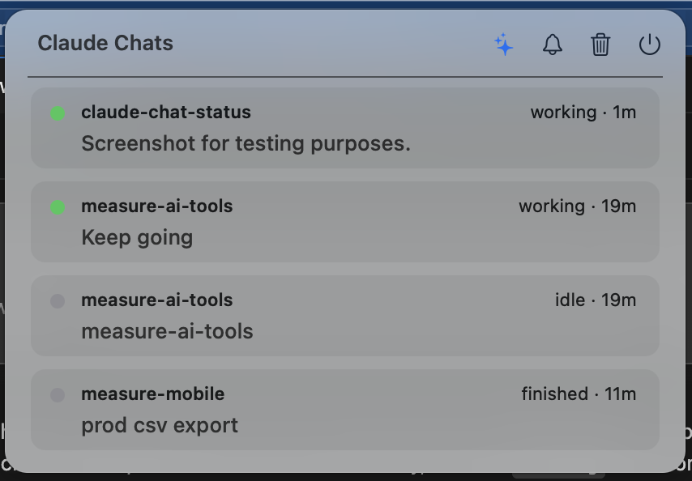

# claude-chat-status

A macOS menu bar app that shows the live status of every Claude Code chat across
all your repos — with click-to-jump routing and notifications when a chat
finishes or needs your input.



The menu bar shows a dot + count per status (`● 1  ● 2  ● 1` — orange = needs
you, green = working, gray = idle/done). Each chat is a card: repo + branch,
status + age, and a one-line description of what it's doing.

## Install

```bash
./install.sh              # build, register hooks, launch
./install.sh --login      # also auto-start at login
./install.sh --uninstall  # remove hooks + login item
```

Idempotent and location-independent — clone anywhere and run it. It patches
`~/.claude/settings.json` with hooks guarded by a file-existence check, so a
missing script no-ops rather than blocking Claude.

**Requires:** macOS · [`jq`](https://jqlang.github.io/jq/) (`brew install jq`) ·
VS Code with the Claude Code extension (for click-to-jump).

## Usage

- **Click a card** to jump to that conversation — focuses the VS Code window for
  that repo, then deep-links the session. Clicking a notification does the same.
- **Orange cards say what Claude is blocked on** (e.g. *"Claude needs your
  permission to use Bash"*), and their age is how long you've kept it waiting.
  Left unanswered for 5 minutes, you get one follow-up ping.
- **Working ages are true turn durations** (time since your prompt, not since
  the last event), and the *finished* notification includes it (`Claude
  finished · 12m`).
- **Hover a card** to reveal a **✕** that removes just that chat (any status) —
  handy for sessions you opened and abandoned.
- **✨** AI summaries · **🔔** notification pings · **🗑** clear idle/finished · **⏻** quit.
- **Esc** closes the panel. **Right-click** the menu bar item for a native menu
  (clear / pause notifications / quit) without opening the panel.
- **⌃⌥C** toggles the panel from anywhere (Carbon hotkey, no Accessibility
  permission). Rebind with
  `defaults write com.measure.chatstatus hotkeyKeyCode -int <code>` and
  `… hotkeyModifiers -int <carbon mask>`, then relaunch.
- Stale entries (no update in 24h) are pruned automatically.

## How it works

1. **Hooks** in `~/.claude/settings.json` run `update_status.py` on Claude Code
   lifecycle events (`SessionStart`, `UserPromptSubmit`, `PostToolUse`,
   `Notification`, `Stop`, `SessionEnd`), writing one JSON file per session to
   `~/.claude/chat-status/`. `UserPromptSubmit` starts the turn clock;
   `PostToolUse` flips a chat back to *working* the moment an approved tool
   runs (without restarting the clock), so a card doesn't stay orange after you
   answer a permission prompt; `Notification` records what Claude is waiting
   on. `repo`/`branch`/`cwd` are pinned on first sight, so a chat stays
   attached to the window it opened in even if it later `cd`s elsewhere.
2. **ChatStatus.app** (`ChatStatusBar.swift`) polls that directory every 2s,
   shows per-status counts in the menu bar, renders the dropdown, and fires a
   notification when a chat transitions to *needs you* or *finished*.

Statuses: orange `needs_input` · green `working` · gray `done` / `live` (idle).

## AI summaries (optional, macOS 26+)

When Apple's on-device Foundation Models framework is available (macOS 26+ with
Apple Intelligence), each card's description is a ~6-word summary of the chat's
latest prompt, generated locally — free, private, ~0.5s each after a one-time
prewarm. Summaries are cached across relaunches. Toggle with **✨**. Otherwise
cards show the raw prompt and the button is hidden.

## Notes

- Hooks are read at session start — chats opened *before* installing won't report
  until their next session.
- Claude Code's own `inputNeededNotifEnabled` is independent; disable one to avoid
  double pings.
- The app is ad-hoc signed. If notifications don't appear, enable them for
  ChatStatus in System Settings → Notifications.
- Debug without the GUI: `./build/ChatStatus.app/Contents/MacOS/ChatStatus --dump`
